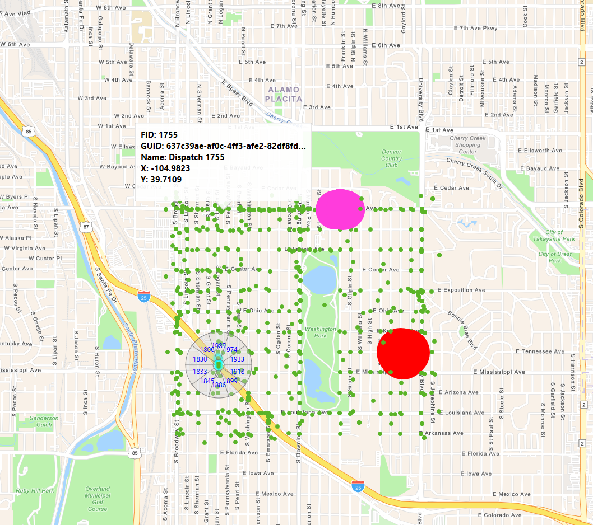

# ArcGISRuntimeClustering

Simple example showing how clustering can be accomplished in ArcGIS Runtime 100.x. This example renders the number of points an associated feature layer service and displays them in a graphics overlay. This sample could be altered to adjust the symbology of a feature layer, but there are performance considerations and approaches to consider.

